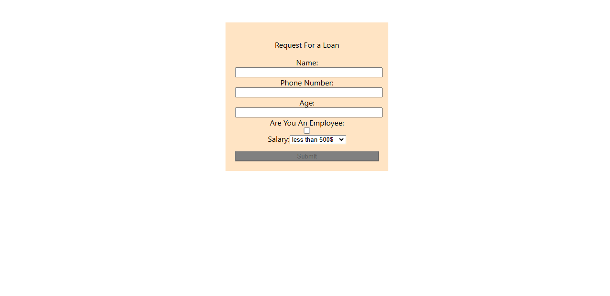

# react-simple-challange-two-form-validation-tarmez

This is a simple project i created it to practice how to send props,how to deal with form and inputs in differents types (text, checkBox, submit) and selects. built with React Js"Hooks"

## Table of contents

- [Overview](#overview)
- [Screenshot](#Screenshot)
- [Links](#Links)
- [Author](#author)
- [Acknowledgments](#Acknowledgments)

## overview

This is a simple project i created it to practice how to send props,how to deal with form and inputs in differents types (text, checkBox, submit) and selects. built with React Js"Hooks"

## Links

If you want to open the link in a new tab, you can:

- Press **Ctrl** (or **Cmd** on Mac) while clicking the link.
- Right-click the link and select **Open link in new tab**.

Otherwise, all links will open in the same tab.

- Solution URL: [here](https://github.com/olahasan/react-simple-challange-two-form-validation-tarmez)

- Live Site URL: [here](https://react-challange-two-form-validation.netlify.app/)

## Screenshot

### Author

GitHub - @olahasan

### Acknowledgments

I would like to thank the **[tarmeez-أكاديمية ترميز](https://www.youtube.com/@tarmeez)** for providing this challenge and to the community for their support.
